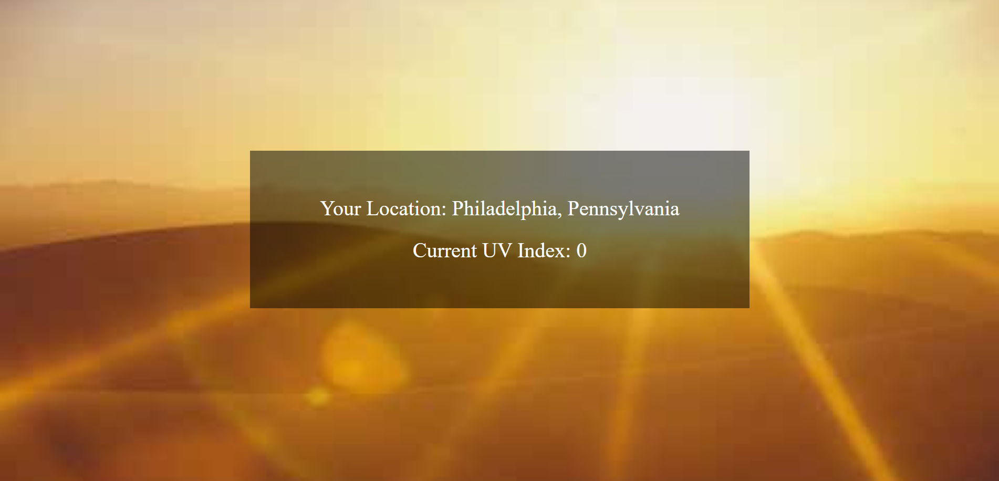

# UV Index API

Link to project: (https://uvindexchecker.netlify.app/)

## How It's Made:
Tech used: HTML, CSS, JS

This application makes two fetch requests - one to https://ipinfo.io to grab the user's current latitude and longitude, which are then plugged into the https://currentuvindex.com/api API to grab the current UV index at that location.

## Optimizations

This application does not store either of its fetch requests in functions - it simply makes both requests on pageload. By doing this, the user can visit the site and immediately receive their local UV Index, optimizing the overall experience.

## Lessons Learned

This project taught me how to use data returned from one API to make a request to another API to produce a simple but useful application.
